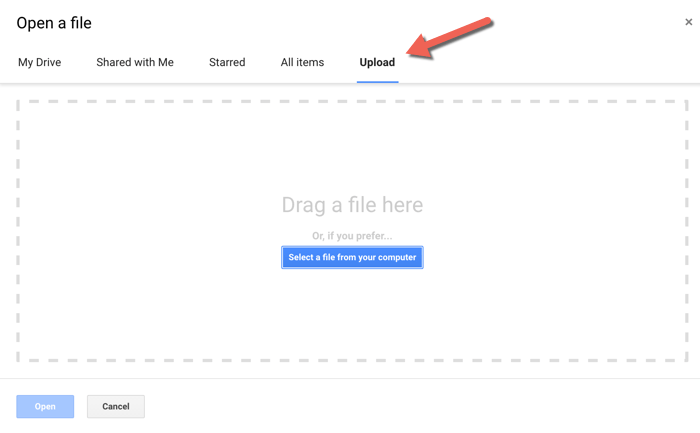

# FinSight
Project Overview:\
FinSight is a finance dashboard that provides personal finance trends at a glance. It builds on top of personal finance app like Mint and allows more flexibility to customize charts and graphs that tailors to your needs.
This program provides a data pipeline that takes in all transaction data in a csv format, cleans and transforms the data, and displays data in a dashboard for visualization. The goal is to better track transactions and visualize spending trends, which will lead to more informed financial decisions.

Getting Started

  - Prerequisite:\
    Download "transactions.csv" from Mint.com and save it your project folder
    
    
  
  <details>
  <summary>Installation / Set up</summary>
  - Upload data sources to Google Sheets
  Go to Google Sheets Home > Click the file icon on the top-right corner > Click the Upload tab and drag csv file to the upload section
  
  
  
    Set up Google Data Studio pipeline
    Sign into Google Sheet and open 4 spreadsheets
    Define category_dict, which is a dictionary of key (subcategory) to value (category) pairs
  </details>  
  
  - Usage:\
    Run ```python finsight-compiler.py```\
    How to read a sample report?
    
  - Method:
    This budgeting framework is inspired by the zero-based budgeting system, which is a method to allocate all money earned to expenses, savings, and investment.\
    The goal is to achieve net zero when subtracting expenditures from income, so that every dollar is allocated and has a purpose.
    I break down the main finance categories into 5 cateogries: Monthly Bills, living expense, discretionary spending, occasional spending, and savings    

Documentation
  - Changelog
  - Known bugs


